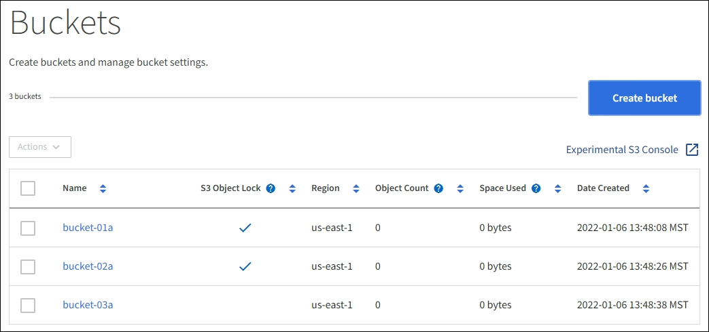

= Supprimez le compartiment S3
:allow-uri-read: 
:icons: font
:imagesdir: ../media/

[role="lead"]
Vous pouvez utiliser le Gestionnaire de locataires pour supprimer une ou plusieurs compartiments S3 vides.

.Ce dont vous avez besoin
* Vous devez être connecté au Gestionnaire de locataires à l'aide d'un xref:../admin/web-browser-requirements.adoc[navigateur web pris en charge].
* Vous devez appartenir à un groupe d'utilisateurs possédant l'autorisation gérer toutes les rubriques ou accès racine. Ces autorisations remplacent les paramètres d'autorisations des stratégies de groupes ou de compartiments. Voir xref:tenant-management-permissions.adoc[Autorisations de gestion des locataires].
* Les compartiments à supprimer sont vides.

.Description de la tâche
Ces instructions expliquent comment supprimer un compartiment S3 à l'aide du Gestionnaire des locataires. Vous pouvez également supprimer des compartiments S3 à l'aide du xref:understanding-tenant-management-api.adoc[API de gestion des locataires] ou le xref:../s3/s3-rest-api-supported-operations-and-limitations.adoc[L'API REST S3].

Si ce compartiment contient des objets ou des versions d'objet non actuelles, vous ne pouvez pas le supprimer. Pour plus d'informations sur la suppression des objets avec version S3, consultez le xref:../ilm/index.adoc[instructions de gestion des objets avec gestion du cycle de vie des informations].

.Étapes
. Sélectionnez *STOCKAGE (S3)* *seaux*.
+
La page compartiments s'affiche et affiche tous les compartiments S3 existants.

+

. Cochez la case du compartiment vide que vous souhaitez supprimer. Vous pouvez sélectionner plusieurs compartiments à la fois.
+
Le menu actions est activé.

. Dans le menu actions, sélectionnez *Supprimer le compartiment* (ou *Supprimer les compartiments* si vous en avez choisi plusieurs).
+
image::../media/delete_bucket_button.png[Bouton Supprimer les rubriques]

. Lorsque la boîte de dialogue de confirmation s'affiche, sélectionnez *Oui* pour supprimer tous les compartiments que vous avez choisis.
+
La fonction StorageGRID confirme que chaque compartiment est vide, puis supprime chaque compartiment. Cette opération peut prendre quelques minutes.

+
Si un compartiment n'est pas vide, un message d'erreur s'affiche. Vous devez supprimer tous les objets avant de pouvoir supprimer un compartiment.

