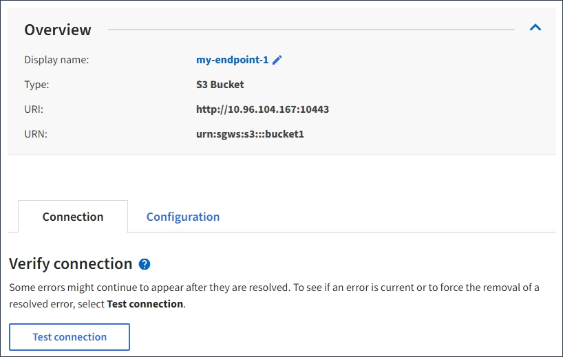

= Tester la connexion pour le point final des services de plate-forme
:allow-uri-read: 
:icons: font
:imagesdir: ../media/

[role="lead"]
Si la connexion à un service de plate-forme a changé, vous pouvez tester la connexion du noeud final pour vérifier que la ressource de destination existe et qu'elle peut être atteinte à l'aide des informations d'identification que vous avez spécifiées.

.Ce dont vous avez besoin, 8217;ll
* Vous devez être connecté au Gestionnaire de locataires à l'aide d'un xref:../admin/web-browser-requirements.adoc[navigateur web pris en charge].
* Vous devez appartenir à un groupe d'utilisateurs possédant l'autorisation gérer les noeuds finaux.

StorageGRID ne vérifie pas que les informations d'identification disposent des autorisations appropriées.

.Étapes
. Sélectionnez *STORAGE (S3)* *Platform services Endpoints*.
+
La page noeuds finaux des services de plate-forme s'affiche et affiche la liste des noeuds finaux des services de plate-forme déjà configurés.

+
image::../media/endpoints_list.png[Liste des noeuds finaux]

. Sélectionnez le noeud final dont vous souhaitez tester la connexion.
+
La page des détails du point final s'affiche.

+

. Sélectionnez *Tester la connexion*.
+
** Un message de réussite s'affiche si le noeud final peut être atteint à l'aide des informations d'identification spécifiées. La connexion au noeud final est validée à partir d'un nœud sur chaque site.
** Un message d'erreur s'affiche si la validation du noeud final échoue. Si vous devez modifier le noeud final pour corriger l'erreur, sélectionnez *Configuration* et mettez à jour les informations. Sélectionnez ensuite *Test et enregistrer les modifications*.

