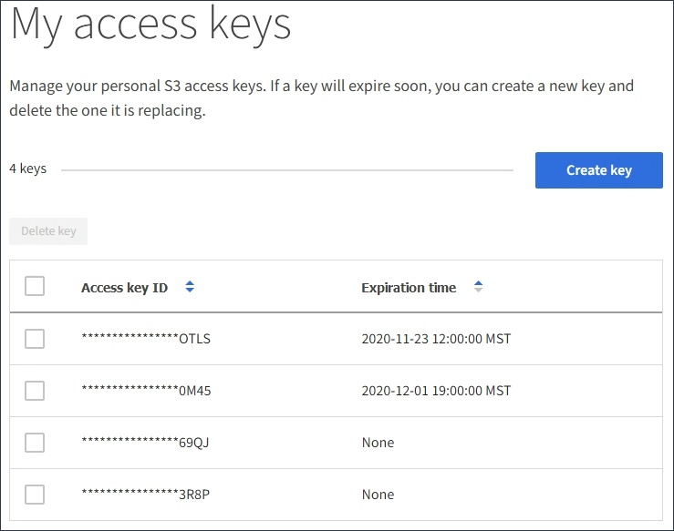

= Affichez vos clés d'accès S3
:allow-uri-read: 
:icons: font
:imagesdir: ../media/

[role="lead"]
Si vous utilisez un locataire S3 et que vous disposez des autorisations appropriées, vous pouvez afficher la liste de vos clés d'accès S3. Vous pouvez trier la liste en fonction de l'heure d'expiration afin de déterminer quelles clés vont bientôt expirer. Si nécessaire, vous pouvez créer de nouvelles clés ou supprimer des clés que vous n'utilisez plus.

.Ce dont vous avez besoin, 8217;ll
* Vous devez être connecté au Gestionnaire de locataires à l'aide d'un xref:../admin/web-browser-requirements.adoc[navigateur web pris en charge].
* Vous devez disposer de l'autorisation gérer vos propres informations d'identification S3.

IMPORTANT: Vous pouvez accéder aux compartiments S3 et aux objets appartenant à votre compte à l'aide de l'ID de clé d'accès et de la clé secrète affichée pour votre compte dans le Gestionnaire des locataires. Pour cette raison, protégez les clés d'accès comme vous le feriez avec un mot de passe. Faites pivoter les clés d'accès régulièrement, supprimez les clés inutilisées de votre compte et ne les partagez jamais avec d'autres utilisateurs.

.Étapes
. Sélectionnez *STOCKAGE (S3)* *Mes clés d'accès*.
+
La page Mes touches d'accès s'affiche et répertorie toutes les clés d'accès existantes.

+

. Trier les clés par *heure d'expiration* ou *ID de clé d'accès*.
. Si nécessaire, créez de nouvelles clés et supprimez manuellement les clés que vous n'utilisez plus.
+
Si vous créez de nouvelles clés avant l'expiration des clés existantes, vous pouvez commencer à utiliser les nouvelles clés sans perdre temporairement l'accès aux objets du compte.

+
Les clés expirées sont supprimées automatiquement.

xref:creating-your-own-s3-access-keys.adoc[Créez vos propres clés d'accès S3]

xref:deleting-your-own-s3-access-keys.adoc[Supprimez vos propres clés d'accès S3]
