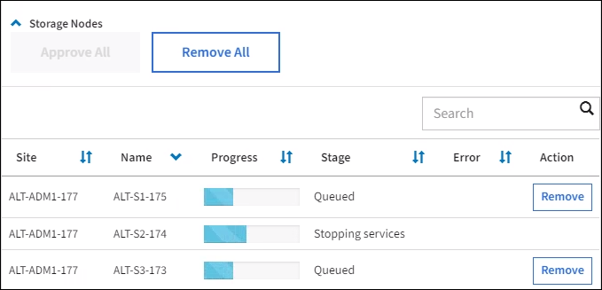

= Effectuez la mise à niveau
:allow-uri-read: 
:icons: font
:imagesdir: ../media/

[role="lead"]
Lorsque vous êtes prêt à effectuer la mise à niveau, vous sélectionnez le `.upgrade` archivez et entrez la phrase de passe de provisionnement. En tant qu'option, vous pouvez exécuter les contrôles préalables à la mise à niveau avant d'effectuer la véritable mise à niveau.

Vous avez passé en revue toutes les considérations et terminé toutes les étapes de planification et de préparation.

== Téléchargez le fichier de mise à niveau

. Connectez-vous au Grid Manager à l'aide d'un xref:../admin/web-browser-requirements.adoc[navigateur web pris en charge].
. Sélectionnez *Maintenance* *système* *mise à jour du logiciel*.
+
La page mise à jour du logiciel s'affiche.

. Sélectionnez *mise à niveau StorageGRID*.
. Sur la page mise à niveau de StorageGRID, sélectionnez `.upgrade` archivage.
+
.. Sélectionnez *Parcourir*.
.. Localisez et sélectionnez le fichier : `NetApp_StorageGRID_11.6.0_Software_uniqueID.upgrade`
.. Sélectionnez *Ouvrir*.
+
Le fichier est téléchargé et validé. Une fois le processus de validation terminé, une coche verte s'affiche en regard du nom du fichier de mise à niveau.

. Entrez la phrase de passe de provisionnement dans la zone de texte.
+
Les boutons *Exécuter les contrôles préalables* et *Démarrer la mise à niveau* deviennent activés.

+
image::../media/storagegrid_upgrade_buttons_enabled.png[Boutons de mise à niveau StorageGRID activés]

== Exécutez des contrôles préalables

Vous pouvez également valider l'état de votre système avant de démarrer la véritable mise à niveau. La sélection de *Exécuter les contrôles préalables* vous permet de détecter et de résoudre les problèmes avant de démarrer la mise à niveau. Les mêmes contrôles préalables sont effectués lorsque vous démarrez la mise à niveau. Les défaillances de précontrôle arrêtent le processus de mise à niveau et d'autres peuvent nécessiter une intervention du support technique.

. Sélectionnez *Exécuter les contrôles préalables*.
. Attendez la fin des contrôles préalables.
. Suivez les instructions pour résoudre toutes les erreurs de vérification préalable qui sont signalées.
+

IMPORTANT: Si vous avez ouvert des ports de pare-feu personnalisés, vous êtes averti lors de la validation de contrôle préalable. Vous devez contacter le support technique avant de procéder à la mise à niveau.

== Démarrez la mise à niveau et mettez à jour le nœud d'administration principal

Lorsque la mise à niveau démarre, des contrôles préalables à la mise à niveau sont effectués et le nœud d'administration principal est mis à niveau, notamment l'arrêt des services, la mise à niveau du logiciel et le redémarrage des services. Vous ne pouvez pas accéder à Grid Manager pendant la mise à niveau du nœud d'administration principal. Les journaux d'audit seront également indisponibles. Cette mise à niveau peut prendre jusqu'à 30 minutes.

. Lorsque vous êtes prêt à effectuer la mise à niveau, sélectionnez *Démarrer la mise à niveau*.
+
Un avertissement apparaît pour vous rappeler que la connexion de votre navigateur sera perdue lors du redémarrage du nœud d'administration principal.

+
image::../media/software_upgrade_connection_will_be_lost.png[La connexion de mise à niveau logicielle sera perdue]

. Sélectionnez *OK* pour accuser réception de l'avertissement et lancer le processus de mise à niveau.
. Attendez que les contrôles préalables de mise à niveau soient effectués et que le nœud d'administration principal soit mis à niveau.
+

NOTE: Si des erreurs de contrôle préalable sont signalées, résolvez-les et sélectionnez à nouveau *Démarrer la mise à niveau*.

+
Pendant la mise à niveau du nœud d'administration principal, plusieurs *503 : service non disponible* et *problème de connexion au serveur* s'affichent, que vous pouvez ignorer.

+
image::../media/software_upgrade_503_error.png[Erreur de mise à niveau du logiciel 503]

+
image::../media/software_upgrade_problem_connecting_error.png[Problème de mise à niveau du logiciel erreur de connexion]

. Lorsque vous voyez le message *400: Mauvaise demande*, passez à l'étape suivante. La mise à niveau du nœud d'administration est terminée.
+
image::../media/software_upgrade_400_error.png[Erreur de mise à niveau du logiciel 400]

== Effacez le cache du navigateur et reconnectez-vous

. Une fois le nœud d'administration principal mis à niveau, effacez la mémoire cache de votre navigateur Web et reconnectez-vous.
+
Pour obtenir des instructions, reportez-vous à la documentation de votre navigateur Web.

+

IMPORTANT: Vous devez effacer le cache du navigateur Web pour supprimer les ressources obsolètes utilisées par la version précédente du logiciel.

+
L'interface reconçue Grid Manager s'affiche, ce qui indique que le nœud d'administration principal a été mis à niveau.

+
image::../media/grid_manager_dashboard.png[Tableau de bord de Grid Manager]

. Dans la barre latérale, sélectionnez *MAINTENANCE* pour ouvrir le menu Maintenance.
. Dans la section *système*, sélectionnez *mise à jour du logiciel*.
. Dans la section *mise à niveau StorageGRID*, sélectionnez *mise à niveau*.
. Consultez la section avancement de la mise à niveau sur la page mise à niveau StorageGRID, qui fournit des informations sur chaque tâche majeure de mise à niveau.
+
.. *Start Upgrade Service* est la première tâche de mise à niveau. Au cours de cette tâche, le fichier logiciel est distribué aux nœuds de la grille et le service de mise à niveau est démarré.
.. Lorsque la tâche *Start Upgrade Service* est terminée, la tâche *Upgrade Grid Nodes* démarre.
.. Pendant que la tâche *Upgrade Grid Nodes* est en cours, la table Grid Node Status (État du nœud de la grille) s'affiche et affiche l'étape de mise à niveau de chaque nœud de la grille de votre système.

== Téléchargez le progiciel de récupération et mettez à niveau tous les nœuds de la grille

. Une fois que les nœuds de la grille apparaissent dans la table État du nœud de la grille, mais avant d'approuver les nœuds de la grille, xref:obtaining-required-materials-for-software-upgrade.adoc#download-the-recovery-package[Téléchargez une nouvelle copie du progiciel de restauration].
+

IMPORTANT: Vous devez télécharger une nouvelle copie du fichier du progiciel de restauration après avoir mis à niveau la version du logiciel sur le nœud d'administration principal. Le fichier du progiciel de récupération vous permet de restaurer le système en cas de défaillance.

. Vérifiez les informations dans le tableau État du nœud de la grille. Les nœuds de la grille sont organisés en sections par type : nœuds d'administration, nœuds de passerelle d'API, nœuds de stockage et nœuds d'archivage.
+
image::../media/software_upgrade_start_grid_node_status.png[Capture d'écran des nœuds de la grille de mise à niveau après l'exécution du nœud d'administration]

+
Un nœud de grille peut se trouver dans l'une des étapes suivantes lorsque cette page s'affiche en premier :

+
** Effectué (nœud d'administration principal uniquement)
** Préparation de la mise à niveau
** Téléchargement de logiciel en file d'attente
** Téléchargement
** En attente de votre approbation

. Approuver les nœuds de grille que vous êtes prêt à ajouter à la file d'attente de mise à niveau.
+

IMPORTANT: Lorsque la mise à niveau démarre sur un nœud de la grille, les services de ce nœud sont arrêtés. Plus tard, le nœud de la grille est redémarré. Pour éviter les interruptions de service des applications client qui communiquent avec le nœud, n'approuver pas la mise à niveau d'un nœud sauf si vous êtes sûr que ce nœud est prêt à être arrêté et redémarré. Si nécessaire, planifiez une fenêtre de maintenance ou avisez les clients.

+
Vous devez mettre à niveau tous les nœuds grid de votre système StorageGRID, mais vous pouvez personnaliser la séquence de mise à niveau. Vous pouvez approuver des nœuds grid individuels, des groupes de nœuds grid ou tous les nœuds.

+
Si l'ordre de mise à niveau des nœuds est important, approuvez les nœuds ou les groupes de nœuds un par un et attendez que la mise à niveau soit terminée sur chaque nœud avant d'approuver le prochain nœud ou groupe de nœuds.

+
** Sélectionnez un ou plusieurs boutons *Approve* pour ajouter un ou plusieurs nœuds individuels à la file d'attente de mise à niveau. Si vous approuvez plusieurs nœuds du même type, les nœuds seront mis à niveau un par un.
** Sélectionnez le bouton *approuver tout* dans chaque section pour ajouter tous les nœuds du même type à la file d'attente de mise à niveau.
** Sélectionnez le bouton de niveau supérieur *approuver tout* pour ajouter tous les nœuds de la grille à la file d'attente de mise à niveau.
** Sélectionnez *Remove* ou *Remove All* pour supprimer un noeud ou tous les noeuds de la file d'attente de mise à niveau. Vous ne pouvez pas supprimer un noeud lorsque son étape atteint *arrêt services*. Le bouton *Supprimer* est masqué.
+

. Attendez que chaque nœud procède aux étapes de mise à niveau, qui incluent Queued, arrêt des services, arrêt du conteneur, nettoyage des images Docker, mise à niveau des packages du système d'exploitation de base, redémarrage, exécution d'étapes après le redémarrage, démarrage des services et terminé.
+

NOTE: Lorsqu'un nœud d'appliance atteint l'étape mise à niveau des packages du système d'exploitation de base, le logiciel StorageGRID Appliance installer sur l'appliance est mis à jour. Ce processus automatisé garantit que la version du programme d'installation de l'appliance StorageGRID reste synchronisée avec la version du logiciel StorageGRID.

== Mise à niveau terminée

Lorsque tous les nœuds de la grille ont terminé les étapes de mise à niveau, la tâche *mettre à niveau les nœuds de la grille* s'affiche comme étant terminée. Les autres tâches de mise à niveau s'effectuent automatiquement et en arrière-plan.

. Dès que la tâche *Activer les fonctionnalités* est terminée (ce qui se produit rapidement), vous pouvez éventuellement commencer à utiliser les nouvelles fonctionnalités de la version mise à niveau de StorageGRID.
. Pendant la tâche *Upgrade Database*, le processus de mise à niveau vérifie chaque nœud pour vérifier que la base de données Cassandra n'a pas besoin d'être mise à jour.
+

NOTE: La mise à niveau depuis StorageGRID 11.5 vers la version 11.6 ne nécessite pas de mise à niveau de la base de données Cassandra. Toutefois, le service Cassandra sera arrêté et redémarré sur chaque nœud de stockage. Pour les futures versions d'StorageGRID, l'étape de mise à jour de la base de données Cassandra peut prendre plusieurs jours.

. Une fois la tâche *Upgrade Database* terminée, attendez quelques minutes pour que la tâche *final Upgrade Steps* se termine.
+
Une fois la tâche d'étape de mise à niveau finale terminée, la mise à niveau est effectuée.

== Confirmez la mise à niveau

. Vérifiez que la mise à niveau a bien été effectuée.
+
.. Dans la partie supérieure du Gestionnaire de grille, sélectionnez l'icône d'aide et sélectionnez *About*.
.. Vérifiez que la version affichée est bien ce à quoi vous attendre.
.. Sélectionnez *MAINTENANCE* *système* *mise à jour du logiciel*.
.. Dans la section *mise à niveau StorageGRID*, sélectionnez *mise à niveau*.
.. Vérifiez que la bannière verte indique que la mise à niveau du logiciel a été effectuée à la date et à l'heure auxquelles vous vous attendez.
+
image::../media/software_upgrade_done.png[Mise à niveau logicielle effectuée]

. Dans la page de mise à niveau StorageGRID, déterminez si des correctifs sont disponibles pour la version actuelle de StorageGRID.
+

NOTE: Si aucun chemin de mise à jour n'est affiché, il se peut que votre navigateur ne puisse pas accéder au site de support NetApp. Ou bien, la case *Rechercher les mises à jour logicielles* sur la page AutoSupport (*SUPPORT* *Outils* *AutoSupport*) peut être désactivée.

. Si un correctif est disponible, téléchargez le fichier. Ensuite, utilisez le xref:../maintain/storagegrid-hotfix-procedure.adoc[Procédure de correctif StorageGRID] pour appliquer le correctif.
. Vérifiez que les opérations de la grille sont à nouveau normales :
+
.. Vérifiez que les services fonctionnent normalement et qu'il n'y a pas d'alerte inattendue.
.. Vérifiez que les connexions client au système StorageGRID fonctionnent comme prévu.

