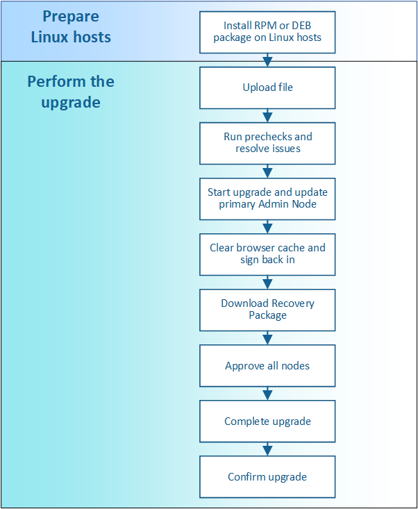

= Mise à niveau du workflow
:allow-uri-read: 
:icons: font
:imagesdir: ../media/

[role="lead"]
Avant de commencer la mise à niveau, passez en revue le workflow général. La page mise à niveau de StorageGRID vous guide à chaque étape de la mise à niveau.

. Si des nœuds StorageGRID sont déployés sur des hôtes Linux, xref:linux-installing-rpm-or-deb-package-on-all-hosts.adoc[Installez le package RPM ou DEB sur chaque hôte] avant de commencer la mise à niveau.
. Depuis le nœud d'administration principal, accédez à la page mise à niveau de StorageGRID et téléchargez le fichier de mise à niveau.
. Exécutez éventuellement des contrôles préalables à la mise à niveau pour détecter et résoudre les problèmes avant de démarrer la mise à niveau.
. Démarrez la mise à niveau, qui exécute automatiquement des précontrôles et met à niveau le nœud d'administration principal. Vous ne pouvez pas accéder à Grid Manager pendant la mise à niveau du nœud d'administration principal. Les journaux d'audit seront également indisponibles. Cette mise à niveau peut prendre jusqu'à 30 minutes.
. Une fois le nœud d'administration principal mis à niveau, effacez le cache de votre navigateur Web, reconnectez-vous et revenez à la page mise à niveau de StorageGRID.
. Téléchargez un nouveau progiciel de restauration.
. Approuver les nœuds de la grille. Vous pouvez approuver des nœuds grid individuels, des groupes de nœuds grid ou tous les nœuds.
+

IMPORTANT: N'approuvez pas la mise à niveau d'un nœud de la grille sauf si vous êtes sûr que ce nœud est prêt à être arrêté et redémarré.

. Reprendre les opérations. Une fois tous les nœuds de la grille mis à niveau, de nouvelles fonctionnalités sont activées et vous pouvez reprendre les opérations. Vous devez attendre que la tâche d'arrière-plan *Upgrade Database* et la tâche *final Upgrade Steps* soient terminées pour effectuer une mise hors service ou une extension.
. Une fois la mise à niveau terminée, confirmer la version du logiciel et appliquer les correctifs.

xref:estimating-time-to-complete-upgrade.adoc[Estimer le temps nécessaire pour effectuer une mise à niveau]
